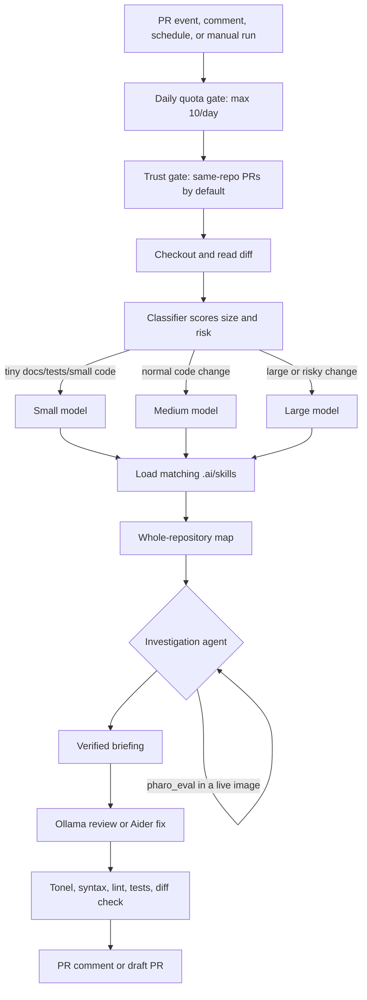

# Pharo Agent CI Controller

This repo contains a small controller for running a local Ollama coding model from GitHub Actions. GitHub talks to your self-hosted CI runner; the runner calls the local model. The model never receives a GitHub token and never connects to GitHub directly.



## What It Does

- Reviews trusted pull requests automatically.
- Classifies each PR and picks the smallest model that should handle it.
- Loads **repository skills** from `.ai/skills/*.md` so you can teach it your stack.
- Builds a **map of the whole repository** — every file, every Pharo class, superclass, and selector.
- Runs an **investigation agent** that reads files, runs allowlisted checks, and evaluates code in a **live Pharo image** before writing anything.
- Sweeps the last N open issues and opens **one draft PR per issue**.
- **Discusses its own PRs with you** — when you review, it replies thread by thread, pushes the fixes it agrees with, and disputes the ones it can disprove.
- Validates changed `.st` files with a real Tonel parser, plus syntax checks for Python, shell, JSON, and JavaScript.
- Runs your configured lint and test commands.
- Limits Pharo Agent jobs to 10 per repository per UTC day by default.
- Responds to `/ai review` and `/ai fix` comments.
- Opens draft PRs only. Human review is still required.
- **Tests itself** — unit CI, a runner self-check, and a scored Pharo capability benchmark.

## Teaching It Your Project

Skills live in the **target** repository under `.ai/skills/*.md`, versioned with the code:

```markdown
---
name: pharo
description: How to read, write, and verify Pharo code here
when: ["src/**/*.st", "**/*.class.st"]
tools: [pharo_eval, pharo_class_source, pharo_method_source]
validate: ["./bin/run-pharo-tests"]
---

The image is the source of truth, not your memory. Before using any selector,
call pharo_class_source to confirm it exists...
```

A skill loads when its `when` globs match a changed file (or, for issue runs, any file in the repo). Its `tools` decide whether a Pharo image boots. Its `validate` commands become both a validation gate and the **only** commands the agent is permitted to run — there is no general shell tool.

See [`.ai/skills/pharo.md`](.ai/skills/pharo.md) for a complete working example.

## The Live Image

When a run touches `.class.st` files, the controller copies your base image, loads the project, and starts `PharoMcpServer` on a free port for that run only. The agent can then check reality instead of guessing:

```
pharo_class_source(className: "OrderedCollection")   → the real selector list
pharo_eval(code: "1 bogusSelector")                  → MessageNotUnderstood
```

This is what makes Smalltalk viable for a local model: selector hallucination gets caught during investigation rather than in your PR. The image is a scratchpad — every persisted edit still goes through Tonel files on disk and the normal validation gate.

Set `PHARO_VM` and `PHARO_IMAGE` on the runner, plus either `PHARO_BASELINE` or a `.ai/pharo-load.st` in the target repo. If Pharo is not configured or fails to boot, the controller says so and continues without it.

## Reviewing Its PRs

Review a PR the AI opened and it answers you thread by thread, with one of three verdicts:

```
**Agreed** — fixed in `9f2c1ab`.
Correct, `count` can be nil before `initialize` runs.
```

````
**I think this one is not right** — leaving it for you to decide.
`addAll:` does exist on OrderedCollection — I checked in the image before writing it.

Evidence:

```text
pharo_eval: (OrderedCollection new addAll: #(1 2); yourself)
-> an OrderedCollection(1 2)
```
````

```
**Need a steer before changing this.**
Do you want the timeout per-evaluation or per-connection?
```

Everything it agrees with lands as **one commit on the same branch**, and only if the whole validation gate passes. If validation fails it says so rather than claiming a fix that does not exist. Threads it disputes stay unresolved on purpose — those need your decision, not its.

This is the part that needed the live image. A local model asked "are you sure?" will fold and break working code. This one can check and answer.

Triggers on a submitted review, an inline review comment, or `/ai reply`. Only on `ai/issue-*` and `ai/fix-pr-*` branches unless you set `PHARO_AGENT_RESPOND_ANY_PR=true`. Use `PHARO_AGENT_RESPOND_NO_AMEND=true` if you want words only and no commits.

It cannot talk to itself: comments made with `GITHUB_TOKEN` do not trigger workflows, every posted body carries an `<!-- ai-ci-controller -->` marker, and a thread only counts as pending when the last word was yours. Resolve a thread to end it.

## Does It Actually Work?

Three commands, three different questions:

```bash
python -m pytest tests -q                      # did I break the controller?
./scripts/ai-ci-controller selfcheck           # can this machine do the work?
./scripts/ai-ci-controller bench --bench-model <model>   # can the model do Pharo?
```

`selfcheck` verifies Ollama answers, your models are pulled, and the Pharo image genuinely boots and evaluates `3 + 4`. It exits non-zero on a required failure, so it gates a new runner.

`bench` scores ten seeded tasks: can the model write Tonel that parses, does it invent selectors that do not exist, does it find a seeded bug. Selector ground truth comes from the live image at run time, not a hardcoded answer. Run it with and without `--no-tools` — the gap is what the image is worth for your model.

The benchmark **never gates**; local output varies too much for a threshold to mean anything. Read the trend.

Benchmark an instruction-tuned model. Completion-tuned checkpoints score near zero because the tasks are instructions, not continuations — that measures the mismatch, not Pharo knowledge.

`.github/workflows/ci.yml` runs the suite on Python 3.11/3.12/3.13 plus ruff on every push, on GitHub-hosted runners — no Ollama or Pharo needed, the tests are hermetic.

## Teaching It Your Project

Skills live in the **target** repository under `.ai/skills/*.md`, versioned with the code:

```markdown
---
name: pharo
description: How to read, write, and verify Pharo code here
when: ["src/**/*.st", "**/*.class.st"]
tools: [pharo_eval, pharo_class_source, pharo_method_source]
validate: ["./bin/run-pharo-tests"]
---

The image is the source of truth, not your memory. Before using any selector,
call pharo_class_source to confirm it exists...
```

A skill loads when its `when` globs match a changed file (or, for issue runs, any file in the repo). Its `tools` decide whether a Pharo image boots. Its `validate` commands become both a validation gate and the **only** commands the agent is permitted to run — there is no general shell tool.

See [`.ai/skills/pharo.md`](.ai/skills/pharo.md) for a complete working example.

## The Live Image

When a run touches `.class.st` files, the controller copies your base image, loads the project, and starts `PharoMcpServer` on a free port for that run only. The agent can then check reality instead of guessing:

```
pharo_class_source(className: "OrderedCollection")   → the real selector list
pharo_eval(code: "1 bogusSelector")                  → MessageNotUnderstood
```

This is what makes Smalltalk viable for a local model: selector hallucination gets caught during investigation rather than in your PR. The image is a scratchpad — every persisted edit still goes through Tonel files on disk and the normal validation gate.

Set `PHARO_VM` and `PHARO_IMAGE` on the runner, plus either `PHARO_BASELINE` or a `.ai/pharo-load.st` in the target repo. If Pharo is not configured or fails to boot, the controller says so and continues without it.

## Reviewing Its PRs

Review a PR the AI opened and it answers you thread by thread, with one of three verdicts:

```
**Agreed** — fixed in `9f2c1ab`.
Correct, `count` can be nil before `initialize` runs.
```

````
**I think this one is not right** — leaving it for you to decide.
`addAll:` does exist on OrderedCollection — I checked in the image before writing it.

Evidence:

```text
pharo_eval: (OrderedCollection new addAll: #(1 2); yourself)
-> an OrderedCollection(1 2)
```
````

```
**Need a steer before changing this.**
Do you want the timeout per-evaluation or per-connection?
```

Everything it agrees with lands as **one commit on the same branch**, and only if the whole validation gate passes. If validation fails it says so rather than claiming a fix that does not exist. Threads it disputes stay unresolved on purpose — those need your decision, not its.

This is the part that needed the live image. A local model asked "are you sure?" will fold and break working code. This one can check and answer.

Triggers on a submitted review, an inline review comment, or `/ai reply`. Only on `ai/issue-*` and `ai/fix-pr-*` branches unless you set `PHARO_AGENT_RESPOND_ANY_PR=true`. Use `PHARO_AGENT_RESPOND_NO_AMEND=true` if you want words only and no commits.

It cannot talk to itself: comments made with `GITHUB_TOKEN` do not trigger workflows, every posted body carries an `<!-- ai-ci-controller -->` marker, and a thread only counts as pending when the last word was yours. Resolve a thread to end it.

## 1. Prepare The CI Machine

Install Ollama, pull your coding model, and keep Ollama running:

```bash
ollama pull <your-coding-model>
OLLAMA_CONTEXT_LENGTH=32768 ollama serve
```

Give it real context. With the repository map, skills, investigation briefing, and RAG pack, a Pharo issue prompt runs around 10k tokens — 8192 will silently truncate the most important part. If your hardware cannot hold 32k, lower `MAX_CONTEXT_CHARS` and `MAX_REPO_MAP_CHARS` instead of letting Ollama truncate.

Install Aider and authenticate GitHub CLI:

```bash
python -m pip install aider-install
aider-install

gh auth login
```

Use a dedicated machine for this. For production, prefer an isolated VM/container per job.

## 2. Add The Runner To Your GitHub Organization

In GitHub:

1. Go to `Organization Settings -> Actions -> Runner groups`.
2. Create a runner group, for example `pharo-agent-runners`.
3. Set access to `Selected repositories`.
4. Add only the repositories that should be allowed to use this machine.
5. Go to `Organization Settings -> Actions -> Runners`.
6. Add your machine as a self-hosted runner.
7. Give the runner this label:

```text
pharo-agent
```

The workflows use:

```yaml
runs-on: [self-hosted, pharo-agent]
```

## 3. Configure Each Target Repository

Add these repository or organization variables:

```text
PHARO_AGENT_MODEL_SMALL=<fast-small-coding-model>
PHARO_AGENT_MODEL_MEDIUM=<normal-coding-model>
PHARO_AGENT_MODEL_LARGE=<strong-large-coding-model>
PHARO_AGENT_MODEL=<fallback-model>
OLLAMA_BASE_URL=http://127.0.0.1:11434
PHARO_AGENT_DAILY_LIMIT=10
PHARO_AGENT_TEST_CMD=<your test command>
PHARO_AGENT_LINT_CMD=<your lint command>
PHARO_AGENT_ALLOW_FORKS=false
PHARO_AGENT_ISSUE_LIMIT=5
PHARO_AGENT_SWEEP_DRY_RUN=true
PHARO_AGENT_RESPOND_ANY_PR=false
PHARO_AGENT_RESPOND_NO_AMEND=false
```

For a Pharo repository, also set:

```text
PHARO_VM=/opt/pharo/pharo
PHARO_IMAGE=/opt/pharo/Pharo.image
PHARO_BASELINE=LLMPharoAgent
```

Example:

```text
PHARO_AGENT_MODEL_SMALL=qwen2.5-coder:3b
PHARO_AGENT_MODEL_MEDIUM=qwen2.5-coder:7b
PHARO_AGENT_MODEL_LARGE=qwen2.5-coder:14b
PHARO_AGENT_MODEL=qwen2.5-coder:7b
PHARO_AGENT_TEST_CMD=pytest -q
PHARO_AGENT_LINT_CMD=ruff check .
```

The classifier uses `PHARO_AGENT_MODEL_SMALL` for tiny docs/tests/small code diffs, `PHARO_AGENT_MODEL_MEDIUM` for normal changes, and `PHARO_AGENT_MODEL_LARGE` for large diffs or risky areas like auth, security, database migrations, dependency lockfiles, CI, infra, billing, and permissions. If a tier variable is missing, it falls back to `PHARO_AGENT_MODEL`.

The selected tier also controls prompt size. Small runs cap RAG context to 10 files / 30k chars and diff text to 40k chars. Medium runs cap context to 20 files / 70k chars and diff text to 90k chars. Large runs use the configured maximums.

Then enable PR creation:

`Repository Settings -> Actions -> General -> Workflow permissions`

Enable:

```text
Allow GitHub Actions to create and approve pull requests
```

## 4. Use It In Pull Requests

Normal review is automatic. When a trusted same-repository PR is opened, updated, reopened, or marked ready for review, this workflow runs:

```text
Pharo Agent PR Review
```

To request another review, comment on the PR:

```text
/ai review
```

To ask the agent to create a draft fix PR, comment:

```text
/ai fix
```

To make it answer outstanding review feedback, comment:

```text
/ai reply
```

Autofix is intentionally comment-driven. Review can run automatically; code changes require an explicit `/ai fix` or manual workflow run.

## 5. Run It Manually

From GitHub Actions:

- `Pharo Agent PR Review`: review an existing PR.
- `Pharo Agent PR Autofix`: create a draft fix PR for an existing PR.
- `Pharo Agent Issue PR`: create a draft PR for one issue.
- `Pharo Agent Issue Sweep`: open one draft PR per recent issue. Weekly, dry run by default.
- `Pharo Agent PR Conversation`: respond to review feedback on a PR the AI opened.

From the runner machine:

```bash
export MODEL="<your-coding-model>"
export MODEL_SMALL="<fast-small-coding-model>"
export MODEL_MEDIUM="<normal-coding-model>"
export MODEL_LARGE="<strong-large-coding-model>"
export OLLAMA_BASE_URL="http://127.0.0.1:11434"
export TEST_CMD="pytest -q"
export LINT_CMD="ruff check ."

export PHARO_VM="/opt/pharo/pharo"
export PHARO_IMAGE="/opt/pharo/Pharo.image"
export PHARO_BASELINE="LLMPharoAgent"

./scripts/ai-ci-controller review-pr    --repo OWNER/REPO --pr 123    --dry-run
./scripts/ai-ci-controller fix-pr       --repo OWNER/REPO --pr 123    --dry-run
./scripts/ai-ci-controller issue-pr     --repo OWNER/REPO --issue 456 --dry-run
./scripts/ai-ci-controller sweep-issues   --repo OWNER/REPO --limit 5 --dry-run
./scripts/ai-ci-controller respond-review --repo OWNER/REPO --pr 123  --dry-run
```

Remove `--dry-run` only after the runner, GitHub permissions, Ollama model, Pharo image, lint, and tests are correct.

## 6. Sweep Issues Into PRs

```bash
./scripts/ai-ci-controller sweep-issues --repo OWNER/REPO --limit 5 --label bug --dry-run
```

Takes the most recent open issues and opens one draft PR per issue, each on its own branch with `Closes #N`. Issues that already have an open `ai/issue-N-*` PR are skipped. An issue that fails validation is reported and skipped without blocking the rest. The daily quota is re-checked before each issue, so the sweep stops cleanly rather than blowing through your budget.

Change the count with `--limit` or the `PHARO_AGENT_ISSUE_LIMIT` repository variable.

## Safety Rules

- Fork PRs are blocked by default.
- Do not set `PHARO_AGENT_ALLOW_FORKS=true` unless each job runs in a disposable isolated environment.
- The model never receives `GH_TOKEN`.
- The agent has no general shell tool. `run_check` accepts only commands you listed in a skill's `validate:` or configured as the lint/test command.
- Fix mode refuses to publish edits to `.env`, secrets paths, or `.github/workflows`.
- Changed `.st` files must parse as valid Tonel before a PR is opened.
- `git diff --check`, syntax checks, lint, and tests run before draft fix PRs are pushed.
- Each Pharo image is a per-run copy and is destroyed afterwards, so runs cannot contaminate each other.
- Keep branch protection and require human review before merge.

Note that `PHARO_AGENT_TEST_CMD` runs code from the PR under review on your runner. If that machine has an authenticated `gh` session, anyone who can open a same-repository PR can act as that identity. For anything beyond a trusted private repo, isolate each job.

More details are in [docs/pharo-agent-ci.md](docs/pharo-agent-ci.md).
