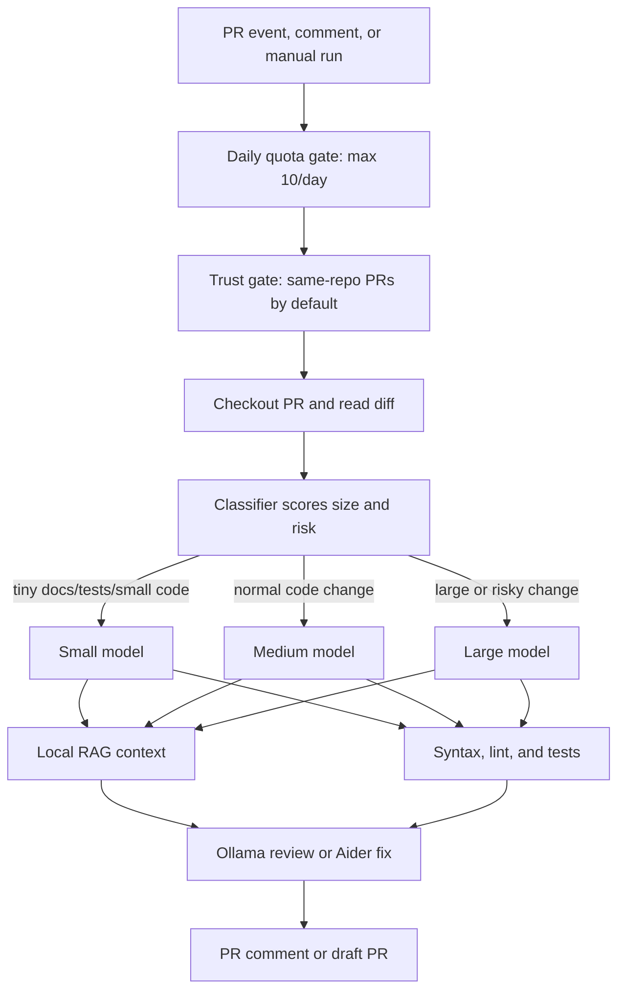

# Local AI CI Controller

This repo contains a small controller for running a local Ollama coding model from GitHub Actions. GitHub talks to your self-hosted CI runner; the runner calls the local model. The model never receives a GitHub token and never connects to GitHub directly.



## What It Does

- Reviews trusted pull requests automatically.
- Classifies each PR and picks the smallest model that should handle it.
- Reads PR comments and previous reviews as context.
- Runs built-in syntax checks for changed Python, shell, JSON, and JavaScript files.
- Runs your configured lint and test commands.
- Limits Local AI jobs to 10 per repository per UTC day by default.
- Responds to `/ai review` and `/ai fix` comments.
- Opens draft PRs only. Human review is still required.

## 1. Prepare The CI Machine

Install Ollama, pull your coding model, and keep Ollama running:

```bash
ollama pull <your-coding-model>
OLLAMA_CONTEXT_LENGTH=8192 ollama serve
```

Install Aider and authenticate GitHub CLI:

```bash
python -m pip install aider-install
aider-install

gh auth login
```

Use a dedicated machine for this. For production, prefer an isolated VM/container per job.

## 2. Add The Runner To Your GitHub Organization

In GitHub:

1. Go to `Organization Settings -> Actions -> Runner groups`.
2. Create a runner group, for example `local-ai-runners`.
3. Set access to `Selected repositories`.
4. Add only the repositories that should be allowed to use this machine.
5. Go to `Organization Settings -> Actions -> Runners`.
6. Add your machine as a self-hosted runner.
7. Give the runner this label:

```text
local-ai
```

The workflows use:

```yaml
runs-on: [self-hosted, local-ai]
```

## 3. Configure Each Target Repository

Add these repository or organization variables:

```text
LOCAL_AI_MODEL_SMALL=<fast-small-coding-model>
LOCAL_AI_MODEL_MEDIUM=<normal-coding-model>
LOCAL_AI_MODEL_LARGE=<strong-large-coding-model>
LOCAL_AI_MODEL=<fallback-model>
OLLAMA_BASE_URL=http://127.0.0.1:11434
LOCAL_AI_DAILY_LIMIT=10
LOCAL_AI_TEST_CMD=<your test command>
LOCAL_AI_LINT_CMD=<your lint command>
LOCAL_AI_ALLOW_FORKS=false
```

Example:

```text
LOCAL_AI_MODEL_SMALL=qwen2.5-coder:3b
LOCAL_AI_MODEL_MEDIUM=qwen2.5-coder:7b
LOCAL_AI_MODEL_LARGE=qwen2.5-coder:14b
LOCAL_AI_MODEL=qwen2.5-coder:7b
LOCAL_AI_TEST_CMD=pytest -q
LOCAL_AI_LINT_CMD=ruff check .
```

The classifier uses `LOCAL_AI_MODEL_SMALL` for tiny docs/tests/small code diffs, `LOCAL_AI_MODEL_MEDIUM` for normal changes, and `LOCAL_AI_MODEL_LARGE` for large diffs or risky areas like auth, security, database migrations, dependency lockfiles, CI, infra, billing, and permissions. If a tier variable is missing, it falls back to `LOCAL_AI_MODEL`.

The selected tier also controls prompt size. Small runs cap RAG context to 10 files / 30k chars and diff text to 40k chars. Medium runs cap context to 20 files / 70k chars and diff text to 90k chars. Large runs use the configured maximums.

Then enable PR creation:

`Repository Settings -> Actions -> General -> Workflow permissions`

Enable:

```text
Allow GitHub Actions to create and approve pull requests
```

## 4. Use It In Pull Requests

Normal review is automatic. When a trusted same-repository PR is opened, updated, reopened, or marked ready for review, this workflow runs:

```text
Local AI PR Review
```

To request another review, comment on the PR:

```text
/ai review
```

To ask the agent to create a draft fix PR, comment:

```text
/ai fix
```

Autofix is intentionally comment-driven. Review can run automatically; code changes require an explicit `/ai fix` or manual workflow run.

## 5. Run It Manually

From GitHub Actions:

- `Local AI PR Review`: review an existing PR.
- `Local AI PR Autofix`: create a draft fix PR for an existing PR.
- `Local AI Issue PR`: create a draft PR for an issue.

From the runner machine:

```bash
export MODEL="<your-coding-model>"
export MODEL_SMALL="<fast-small-coding-model>"
export MODEL_MEDIUM="<normal-coding-model>"
export MODEL_LARGE="<strong-large-coding-model>"
export OLLAMA_BASE_URL="http://127.0.0.1:11434"
export TEST_CMD="pytest -q"
export LINT_CMD="ruff check ."

./scripts/ai-ci-controller review-pr --repo OWNER/REPO --pr 123 --dry-run
./scripts/ai-ci-controller fix-pr --repo OWNER/REPO --pr 123 --dry-run
./scripts/ai-ci-controller issue-pr --repo OWNER/REPO --issue 456 --dry-run
```

Remove `--dry-run` only after the runner, GitHub permissions, Ollama model, lint, and tests are correct.

## Safety Rules

- Fork PRs are blocked by default.
- Do not set `LOCAL_AI_ALLOW_FORKS=true` unless each job runs in a disposable isolated environment.
- The model never receives `GH_TOKEN`.
- Fix mode refuses to publish edits to `.env`, secrets paths, or `.github/workflows`.
- `git diff --check`, syntax checks, lint, and tests run before draft fix PRs are pushed.
- Keep branch protection and require human review before merge.

More details are in [docs/local-ai-ci.md](docs/local-ai-ci.md).
