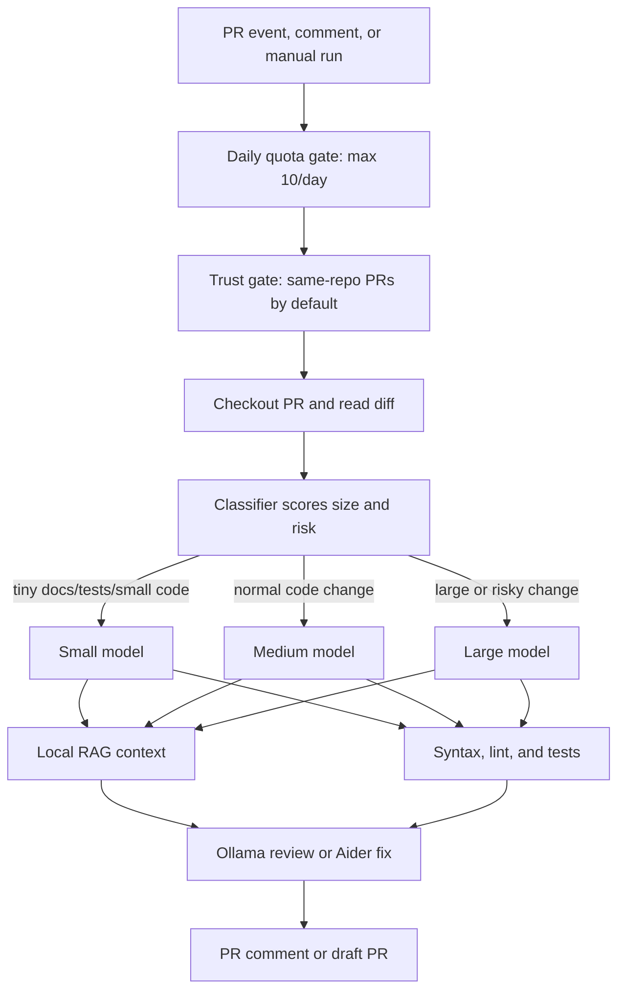

# Local AI CI Controller

This repository now includes a small controller that sits between GitHub and a locally hosted model. The model never receives a GitHub token and never talks to GitHub directly.

```text
GitHub PR event / comment / manual workflow
        |
self-hosted runner
        |
scripts/ai-ci-controller
        |-- gh + git clone/checkout
        |-- model classifier
        |-- local RAG context pack
        |-- Ollama review call
        |-- aider edit pass for fix modes
        |-- lint/tests + git diff --check
        |-- PR comment or draft PR
```



## What It Can Do

- `review-pr`: checks out a trusted pull request, retrieves relevant local repo context, asks Ollama for a structured review, validates file/line references, runs syntax/lint/test checks, and posts a PR comment.
- `fix-pr`: checks out a trusted pull request, gives Aider a scoped task with retrieved context and existing review comments, runs validation, commits the result, pushes a branch, and opens a draft follow-up PR.
- `issue-pr`: checks out the default branch, implements a GitHub issue with Aider, validates it, and opens a draft PR.

## Organization Setup

In GitHub, configure the organization before enabling the workflows:

1. Go to `Organization Settings -> Actions -> Runner groups`.
2. Create a runner group named something like `local-ai-runners`.
3. Set repository access to `Selected repositories` and choose only the repositories that should be allowed to use the AI machine.
4. Add your dedicated machine as an organization self-hosted runner.
5. Give the runner the label `local-ai`.

The workflows use:

```yaml
runs-on: [self-hosted, local-ai]
```

In each target repository, go to `Settings -> Actions -> General -> Workflow permissions` and enable `Allow GitHub Actions to create and approve pull requests`. The workflows still create draft PRs only.

## Runner Setup

Install these on the dedicated CI machine:

```bash
ollama pull <your-coding-model>
OLLAMA_CONTEXT_LENGTH=8192 ollama serve

python -m pip install aider-install
aider-install

gh auth login
```

For GitHub Actions, register the machine as a self-hosted runner with the label `local-ai`.

Set these repository or organization variables:

- `LOCAL_AI_MODEL_SMALL`: fast model for tiny docs/tests/small code diffs.
- `LOCAL_AI_MODEL_MEDIUM`: normal model for most code changes.
- `LOCAL_AI_MODEL_LARGE`: strongest model for large or high-risk changes.
- `LOCAL_AI_MODEL`: fallback model when a tier variable is not set.
- `OLLAMA_BASE_URL`: optional, defaults to `http://127.0.0.1:11434`.
- `LOCAL_AI_TEST_CMD`: optional final test command.
- `LOCAL_AI_LINT_CMD`: optional final lint command.
- `LOCAL_AI_DAILY_LIMIT`: optional, defaults to `10`.
- `LOCAL_AI_ALLOW_FORKS`: optional, defaults to `false`.

The workflows use `GITHUB_TOKEN`. For a long-running shared service, use a GitHub App or a fine-grained token scoped only to the target repositories.

## Model Classifier

The controller classifies each PR before calling Ollama or Aider. The score is deterministic and written to `model-selection.json` in the run artifacts directory.

- `small`: tiny diffs, docs-only changes, small tests, and low-risk code.
- `medium`: normal code changes with moderate size.
- `large`: large diffs or high-risk areas such as auth, security, database migrations, dependency lockfiles, CI workflows, infra, billing, payments, and permissions.

Fix mode adds extra weight because it can modify code. Issue implementation adds extra weight because there is no PR diff to inspect.

The selected tier also controls prompt size:

- `small`: up to 10 context files, 30k context chars, and 40k diff chars.
- `medium`: up to 20 context files, 70k context chars, and 90k diff chars.
- `large`: uses `MAX_CONTEXT_FILES`, `MAX_CONTEXT_CHARS`, and `MAX_DIFF_CHARS`.

## Run Locally

```bash
export MODEL="<your-coding-model>"
export MODEL_SMALL="<fast-small-coding-model>"
export MODEL_MEDIUM="<normal-coding-model>"
export MODEL_LARGE="<strong-large-coding-model>"
export OLLAMA_BASE_URL="http://127.0.0.1:11434"
export TEST_CMD="pytest -q"
export LINT_CMD="ruff check ."

./scripts/ai-ci-controller review-pr --repo OWNER/REPO --pr 123 --dry-run
./scripts/ai-ci-controller fix-pr --repo OWNER/REPO --pr 123 --dry-run
./scripts/ai-ci-controller issue-pr --repo OWNER/REPO --issue 456 --dry-run
```

Remove `--dry-run` only after the runner, credentials, model, and validation commands are correct.

## RAG And Validation

The controller builds a local context pack from the checked out repository. It ranks changed files highest, then tests, docs, manifests, and files with lexical overlap against the PR title, body, and diff. The pack is written under the run artifacts directory as `rag-context.md`.

Validation is deliberately outside the model:

- changed Python, shell, JSON, and JavaScript files get built-in syntax checks when the relevant local tool is installed;
- review findings are sanitized so missing files, path traversal, and invalid line numbers are dropped or corrected;
- fix modes reject edits to secrets, `.env` files, and `.github/workflows`;
- `git diff --check` always runs before publishing;
- configured lint and test commands must pass before a draft PR is pushed.

This is not a replacement for human review. The generated PRs stay in draft state and branch protection should remain required.

## GitHub Actions

The included workflows are:

- `Local AI PR Review`: automatic on trusted PR open/update/reopen/ready-for-review, automatic when an owner/member/collaborator submits a PR review, manual from Actions, and comment-driven with `/ai review`.
- `Local AI PR Autofix`: manual from Actions, or comment-driven with `/ai fix` from an owner/member/collaborator.
- `Local AI Issue PR`: manual from Actions.

The controller enforces a daily quota with `LOCAL_AI_DAILY_LIMIT`. The default workflow configuration allows at most 10 `Local AI...` workflow runs per repository per UTC day. When the quota is exceeded, the controller prints a skip message and exits successfully.

Automatic jobs reject fork PRs unless `LOCAL_AI_ALLOW_FORKS=true`. Do not enable fork PR execution on a valuable persistent machine. If you need public fork support, run each job in a disposable VM/container and wipe it after every job.

## Daily Operation

For normal PR review, do nothing. When a trusted same-repository PR is opened or updated, `Local AI PR Review` runs automatically.

To ask for another review from a PR conversation, comment:

```text
/ai review
```

To ask it to create a draft fix PR, comment:

```text
/ai fix
```

The model never receives the GitHub token. The controller keeps credentials in the runner environment, validates model output, runs local checks, and only then posts comments or opens draft PRs.
