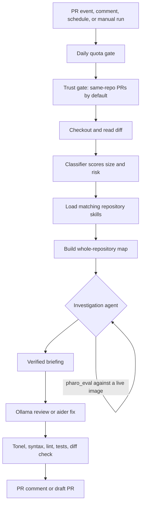

# Pharo Agent CI Controller

This repository includes a controller that sits between GitHub and a locally hosted model. The model never receives a GitHub token and never talks to GitHub directly.

```text
GitHub PR event / comment / schedule / manual workflow
        |
self-hosted runner
        |
scripts/ai-ci-controller
        |-- gh + git clone/checkout
        |-- model classifier
        |-- repository skills (.ai/skills/*.md)
        |-- whole-repository map
        |-- investigation agent (tools: repo reads, allowlisted checks, live Pharo image)
        |-- local RAG context pack
        |-- Ollama review call or aider edit pass
        |-- Tonel/syntax/lint/test validation + git diff --check
        |-- PR comment or draft PR
```



## What It Can Do

- `review-pr`: checks out a trusted pull request, investigates it with tools, asks Ollama for a structured review, validates file/line references, runs validation, and posts a PR comment.
- `fix-pr`: checks out a trusted pull request, investigates, gives aider a scoped task, validates, and opens a draft follow-up PR.
- `issue-pr`: checks out the default branch, implements one GitHub issue, validates, and opens a draft PR.
- `sweep-issues`: takes the most recent open issues and opens **one draft PR per issue**, skipping issues that already have an `ai/issue-N` branch.
- `respond-review`: replies to reviewer feedback on a PR the AI opened, pushing agreed fixes to the same branch and disputing points it can disprove.

## Review Conversations

When you review a PR the AI opened, `respond-review` answers you thread by thread. It is a conversation, not an acknowledgement.

For each unresolved thread the model returns one of three verdicts:

| Verdict | What gets posted | What happens to the code |
| --- | --- | --- |
| `agree` | "**Agreed** — fixed in `abc1234`." | The change is applied, validated, and pushed to the PR branch. |
| `disagree` | "**I think this one is not right**", with the expression it ran and the actual result. | Nothing. The thread stays unresolved for you to decide. |
| `needs-clarification` | One specific question. | Nothing. |

This is where the live image earns its keep. If you say a selector does not exist, the agent can evaluate it and quote the real result back at you rather than deferentially breaking working code. The instruction it works under is explicit: *"never agree to something you could not verify just to be agreeable"*.

### How changes get applied

All agreed changes across all threads are collected into a single aider task, so one round produces one commit, not one commit per comment. That commit only lands if the full validation gate passes — Tonel parse, syntax checks, lint, tests, `git diff --check`. If validation fails, the working tree is reverted and every agreed reply says so honestly instead of claiming a fix that does not exist.

Commits are appended to the existing branch with `git push origin HEAD:<branch>`. There is no force-push, so your review history stays anchored.

Pass `--no-amend` (or `PHARO_AGENT_RESPOND_NO_AMEND=true`) to make it reply in words only and never touch code.

### What starts a round

The `Pharo Agent PR Conversation` workflow triggers on:

- a submitted review (`APPROVED`, `CHANGES_REQUESTED`, `COMMENTED`) from an owner, member, or collaborator;
- a single inline review comment, after a 45-second settle so a burst of comments produces one round rather than one per comment;
- `/ai reply` in the PR conversation;
- manual dispatch.

By default it only responds on `ai/issue-*` and `ai/fix-pr-*` branches, so it never argues on a human-authored PR. Pass `--any-pr` or set `PHARO_AGENT_RESPOND_ANY_PR=true` to lift that.

### Loop safety

Three independent guards, because an AI arguing with itself would burn your quota fast:

1. Comments posted with `GITHUB_TOKEN` do not trigger further workflow runs. This is GitHub behaviour, not configuration.
2. Every posted body carries an `<!-- ai-ci-controller -->` marker, and any comment carrying it — or authored by a `[bot]` account — is treated as ours.
3. A thread needs a response only when it is unresolved **and** the last comment on it is not ours.

The practical effect is that the discussion is turn-based. The AI speaks once per round and then waits for you.

Resolve a thread to end it. Resolved threads are never revisited.

## Repository Skills

Skills are how you teach the model your project. They live in the **target** repository under `.ai/skills/*.md`, so they are versioned with the code and reviewed in PRs like anything else.

A skill is markdown with frontmatter:

```markdown
---
name: pharo
description: How to read, write, and verify Pharo code here
when:
  - "src/**/*.st"
  - "**/*.class.st"
tools: [pharo_eval, pharo_class_source, pharo_method_source]
validate:
  - "./bin/run-pharo-tests"
priority: 10
---

Body markdown. This is injected into the model's prompt verbatim.
```

| Field | Meaning |
| --- | --- |
| `name` | Identifier shown in PR comments. Defaults to the filename. |
| `description` | One line, rendered above the body. |
| `when` | Glob patterns. The skill loads when any changed file matches. `**/` prefixes are optional. |
| `always` | `true` loads the skill on every run regardless of `when`. |
| `tools` | Requests these agent tools. Any `pharo_*` entry causes a Pharo image to boot. |
| `validate` | Commands this skill contributes to validation. These are also the only commands the agent may run. |
| `priority` | Higher sorts first and wins the context budget. Default `0`. |

When there is no diff — the `issue-pr` and `sweep-issues` paths — `when` globs are matched against the whole repository file list instead, so a Pharo skill still loads for a Pharo issue.

Skills are the allowlist for `run_check`. A command the agent can run is a command you wrote down in a skill or configured as `PHARO_AGENT_LINT_CMD` / `PHARO_AGENT_TEST_CMD`. There is no general shell tool.

## The Investigation Agent

Before any review or edit, the controller runs a tool-calling pass whose only job is to establish facts. Its briefing is written to `investigation.md` in the run artifacts and injected into the review or fix prompt.

Available tools:

| Tool | Purpose |
| --- | --- |
| `read_file` | Read any file in the checked-out repository. |
| `list_files` | Glob the repository. |
| `run_check` | Run one command from the allowlist described above. |
| `pharo_eval` | Evaluate Smalltalk in a live image and get the real result or exception. |
| `pharo_class_source` | Get a class definition and its real selector list. |
| `pharo_method_source` | Get the real source of one method. |

The agent may read and evaluate, but **files on disk stay the source of truth**. It cannot compile into the image and have that count as a change; every persisted edit goes through Tonel files and the normal validation gate.

Disable the pass with `--no-agent` or `AI_CI_DISABLE_AGENT=true`. Bound it with `--agent-max-iterations` (default 12).

## The Pharo Image

When a run touches `.class.st` files, or a loaded skill requests a `pharo_*` tool, the controller boots a **throwaway image per run**:

1. Copies `PHARO_IMAGE` (and its `.changes`/`.sources`) into the run directory.
2. Runs the project load step.
3. Starts `PharoMcpServer` on a free port.
4. Polls `GET /mcp` until it answers, then speaks JSON-RPC to it.
5. Terminates the image when the investigation ends.

Nothing leaks between runs and the agent cannot corrupt a shared image.

The load step is resolved in this order:

1. `.ai/pharo-load.st` in the target repository, if it exists. The controller appends the server start to whatever you write.
2. `PHARO_BASELINE`, which generates a Metacello load from `tonel://<repo>/src`.
3. Neither, in which case a bare image starts and the agent can still query base Pharo classes.

Required runner variables:

- `PHARO_VM`: path to the Pharo VM executable. Falls back to `pharo` on `PATH`.
- `PHARO_IMAGE`: path to a base `.image` file. This is a template and is never modified.
- `PHARO_BASELINE`: optional baseline name, e.g. `LLMPharoAgent`.
- `PHARO_BOOT_TIMEOUT`: optional, defaults to 240 seconds.

If Pharo is not configured or fails to boot, the controller prints why and continues without it. It degrades, it does not fail the run.

## Whole-Repository Map

Every run builds a structural map of the entire repository: every file, and for each one its symbols. Pharo classes get their superclass, instance variables, and full class-side and instance-side selector lists. Python, JavaScript, TypeScript, Ruby, Go, Rust, and Java files get top-level definitions.

This is a skeleton, not file bodies — the whole archived Pharo project fits in under 4k characters. File bodies come from the RAG context pack for ranked files, and from `read_file` for anything else the agent wants.

Cap it with `--max-repo-map-chars` (default 40000, `0` disables). It is written to `repo-map.md` in the run artifacts.

## Issue Sweep

```bash
./scripts/ai-ci-controller sweep-issues --repo OWNER/REPO --limit 5 --dry-run
```

Options:

- `--limit`: how many recent open issues to take. Default 5, or `AI_CI_ISSUE_LIMIT`.
- `--label`: repeatable label filter, or `AI_CI_ISSUE_LABELS` as a comma-separated list.
- `--skip-existing`: skip issues that already have an open `ai/issue-N-*` PR. On by default.
- `--stop-on-error`: abort on the first failure instead of continuing.

Each issue gets its own branch, its own validation gate, and its own draft PR linked with `Closes #N`. An issue that fails validation is reported and skipped; it does not block the others. The daily quota is re-checked before each issue, and the sweep stops cleanly when it runs out.

The `Pharo Agent Issue Sweep` workflow runs weekly and **defaults to dry run**. Set the repository variable `PHARO_AGENT_SWEEP_DRY_RUN=false` when you are ready for it to actually open PRs.

## Organization Setup

1. Go to `Organization Settings -> Actions -> Runner groups`.
2. Create a runner group named something like `pharo-agent-runners`.
3. Set repository access to `Selected repositories` and choose only the repositories that should use the AI machine.
4. Add your dedicated machine as an organization self-hosted runner.
5. Give the runner the label `pharo-agent`.

In each target repository, go to `Settings -> Actions -> General -> Workflow permissions` and enable `Allow GitHub Actions to create and approve pull requests`. The workflows still create draft PRs only.

## Runner Setup

```bash
ollama pull <your-coding-model>
OLLAMA_CONTEXT_LENGTH=32768 ollama serve

python -m pip install aider-install
aider-install

gh auth login
```

Context length matters. A Pharo issue prompt carrying the repository map, skills, investigation briefing, and RAG pack measures around 10k tokens. At `OLLAMA_CONTEXT_LENGTH=8192` Ollama truncates silently and you lose the end of the prompt, which is where the retrieved context lives. If the machine cannot hold 32k, reduce `MAX_CONTEXT_CHARS` and `MAX_REPO_MAP_CHARS` rather than letting truncation happen.

Repository or organization variables:

| Variable | Purpose |
| --- | --- |
| `PHARO_AGENT_MODEL_SMALL` | Fast model for tiny docs/tests/small code diffs. |
| `PHARO_AGENT_MODEL_MEDIUM` | Normal model for most code changes. |
| `PHARO_AGENT_MODEL_LARGE` | Strongest model for large or high-risk changes. |
| `PHARO_AGENT_MODEL` | Fallback when a tier variable is not set. |
| `OLLAMA_BASE_URL` | Defaults to `http://127.0.0.1:11434`. |
| `PHARO_AGENT_TEST_CMD` | Final test command. |
| `PHARO_AGENT_LINT_CMD` | Final lint command. |
| `PHARO_AGENT_DAILY_LIMIT` | Defaults to `10`. |
| `PHARO_AGENT_ALLOW_FORKS` | Defaults to `false`. |
| `PHARO_AGENT_MAX_ITERATIONS` | Tool-call rounds. Defaults to `12`. |
| `PHARO_AGENT_ISSUE_LIMIT` | Default sweep size. |
| `PHARO_AGENT_RESPOND_ANY_PR` | Set `true` to respond on human-authored PRs too. Defaults to `false`. |
| `PHARO_AGENT_RESPOND_NO_AMEND` | Set `true` to reply in words only, never pushing commits. |
| `PHARO_AGENT_ISSUE_LABELS` | Comma-separated sweep label filter. |
| `PHARO_AGENT_SWEEP_DRY_RUN` | Set `false` to let the scheduled sweep open PRs. |
| `PHARO_VM`, `PHARO_IMAGE`, `PHARO_BASELINE` | Live Pharo image, see above. |

Model tokens stay in the runner environment. For a long-running shared service, use a GitHub App or a fine-grained token scoped only to the target repositories.

## Model Classifier

The controller classifies each PR before calling Ollama or aider. The score is deterministic and written to `model-selection.json` in the run artifacts.

- `small`: tiny diffs, docs-only changes, small tests, low-risk code.
- `medium`: normal code changes with moderate size.
- `large`: large diffs or high-risk areas such as auth, security, migrations, lockfiles, CI workflows, infra, billing, payments, permissions, and Pharo `BaselineOf*` / `package.st` files.

Fix mode adds weight because it can modify code. Issue implementation adds weight because there is no PR diff to inspect.

The tier also controls prompt size:

- `small`: up to 10 context files, 30k context chars, 40k diff chars.
- `medium`: up to 20 context files, 70k context chars, 90k diff chars.
- `large`: uses `MAX_CONTEXT_FILES`, `MAX_CONTEXT_CHARS`, `MAX_DIFF_CHARS`.

Pharo test packages (`-Tests/`, `*Test.class.st`) are recognised as tests, so a test-only Pharo change routes to the small tier.

## Validation

Validation is deliberately outside the model:

- changed `.st` files are parsed by a Tonel parser that checks the class metadata block, `{ #category : ... }` chunk headers, receiver/class-name agreement, string and comment termination, and bracket balance;
- changed Python, shell, JSON, and JavaScript files get built-in syntax checks when the relevant tool is installed;
- commands from skill `validate:` entries and the configured lint/test commands run;
- review findings are sanitized so missing files, path traversal, and invalid line numbers are dropped or corrected;
- fix modes reject edits to secrets, `.env` files, and `.github/workflows`;
- `git diff --check` always runs before publishing.

Everything must pass before a draft PR is pushed. Aider's own scratch files (`.aider*`) are added to `.git/info/exclude` so they never end up in a generated commit.

This is not a replacement for human review. Generated PRs stay in draft and branch protection should remain required.

## Work Directories

Run directories live under `WORK_ROOT` (default `~/.cache/pharo-agent-ci-controller`). After each run the disposable clone and the copied Pharo image are deleted; the `artifacts/` directory is kept. Directories older than `--work-retention-days` (default 7) are pruned at the start of each run. Use `--keep-work-dir` to keep everything for debugging.

## Run Locally

```bash
export MODEL="<your-coding-model>"
export MODEL_SMALL="<fast-small-coding-model>"
export MODEL_MEDIUM="<normal-coding-model>"
export MODEL_LARGE="<strong-large-coding-model>"
export OLLAMA_BASE_URL="http://127.0.0.1:11434"
export TEST_CMD="pytest -q"
export LINT_CMD="ruff check ."

export PHARO_VM="/opt/pharo/pharo"
export PHARO_IMAGE="/opt/pharo/Pharo.image"
export PHARO_BASELINE="LLMPharoAgent"

./scripts/ai-ci-controller review-pr    --repo OWNER/REPO --pr 123    --dry-run
./scripts/ai-ci-controller fix-pr       --repo OWNER/REPO --pr 123    --dry-run
./scripts/ai-ci-controller issue-pr     --repo OWNER/REPO --issue 456 --dry-run
./scripts/ai-ci-controller sweep-issues --repo OWNER/REPO --limit 5   --dry-run
./scripts/ai-ci-controller respond-review --repo OWNER/REPO --pr 123  --dry-run
```

Remove `--dry-run` only after the runner, credentials, model, image, and validation commands are correct.

## GitHub Actions

- `Pharo Agent PR Review`: automatic on trusted PR open/update/reopen/ready-for-review, automatic when an owner/member/collaborator submits a review, manual from Actions, and comment-driven with `/ai review`. Superseded runs are cancelled when a newer commit lands.
- `Pharo Agent PR Autofix`: manual from Actions, or comment-driven with `/ai fix` from an owner/member/collaborator.
- `Pharo Agent Issue PR`: manual from Actions.
- `Pharo Agent Issue Sweep`: weekly schedule and manual, dry run by default.
- `Pharo Agent PR Conversation`: responds to submitted reviews, inline review comments, and `/ai reply`. Restricted to AI-authored branches by default.

`Pharo Agent PR Review` no longer triggers on `pull_request_review`. That event now belongs to `Pharo Agent PR Conversation`, so a submitted review produces a response rather than a duplicate re-review.

Every job has a `timeout-minutes` cap so a wedged model or image cannot hold the runner indefinitely.

The controller enforces a daily quota with `PHARO_AGENT_DAILY_LIMIT` across all `Pharo Agent...` workflows per repository per UTC day. When exceeded, it prints a skip message and exits successfully.

## Security Notes

Automatic jobs reject fork PRs unless `PHARO_AGENT_ALLOW_FORKS=true`. Do not enable fork execution on a valuable persistent machine.

Be aware of what a self-hosted runner means here: `PHARO_AGENT_TEST_CMD` executes code from the pull request under review. If the runner has an authenticated `gh` session, anyone who can open a same-repository PR can run commands as that identity. Fork blocking does not address this. For anything beyond a trusted private repository, run each job in a disposable VM or container and wipe it afterwards.

The model never receives the GitHub token. The controller keeps credentials in the runner environment, validates model output, runs local checks, and only then posts comments or opens draft PRs.
